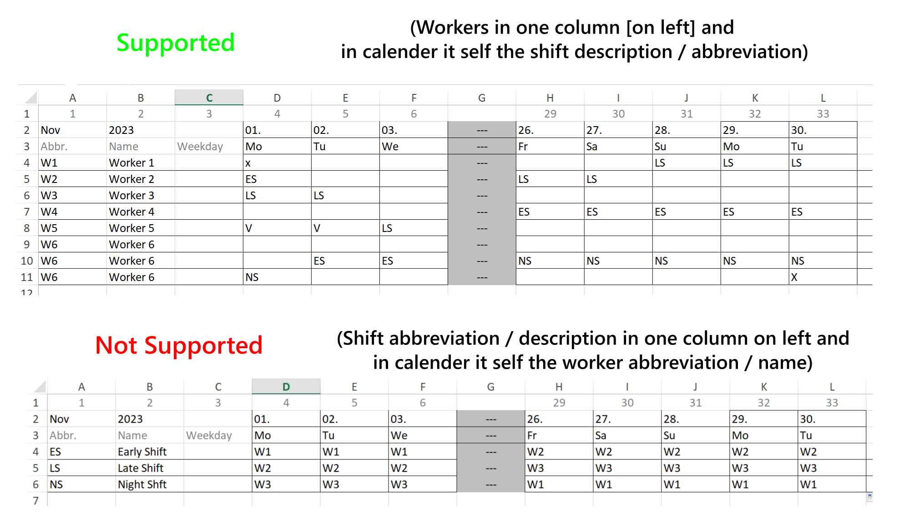
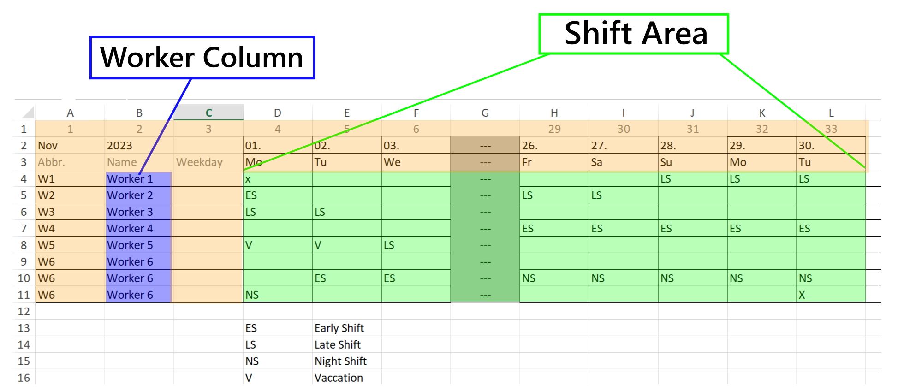
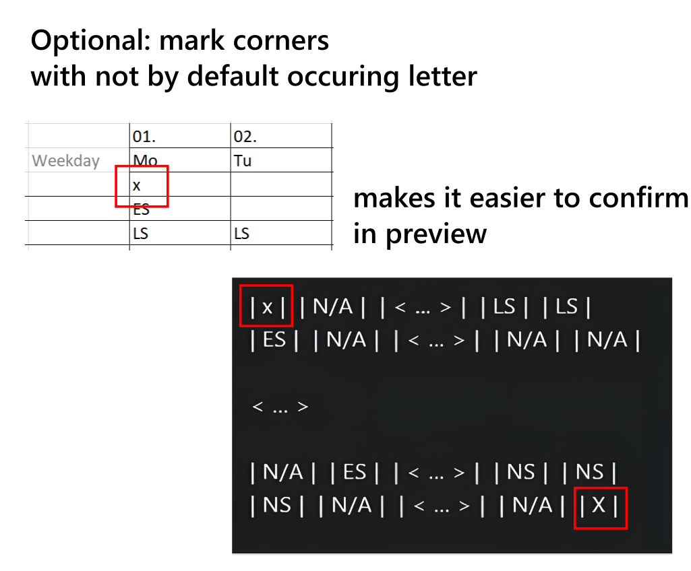
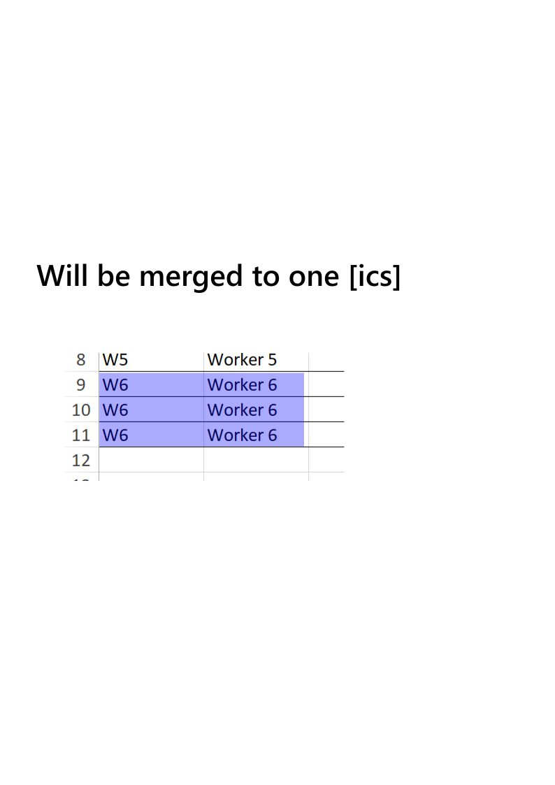

### Anmerkung

Das .ICS (iCalendar)-Dateiformat wird häufig verwendet, um Kalender- und Termininformationen zu speichern und zu teilen. Es handelt sich um ein Textformat, das auf spezielle Weise strukturiert ist, um Kalenderereignisse und Aufgaben darzustellen. Eine ICS-Datei besteht in der Regel aus Textzeilen, die verschiedene Eigenschaften und Attribute von Kalenderkomponenten definieren.

Ein einfaches VEVENT (Kalenderereignis) in einer ICS-Datei sieht in der Regel so aus:
```
BEGIN:VEVENT
SUMMARY:LS // Beschreibung, die im Kalender angezeigt wird
DTSTART:20230914T060000 // Startzeit im Format JJJJMMTTHHMMSS
DTEND:20230914T180000 // Endzeit im Format JJJJMMTTHHMMSS
END:VEVENT
```


### Unterstützte Dienstpläne


## Anleitung

#### Verwendetes Beispiel


#### Erste Schritte

##### 1. Wählen Sie die Eingabedatei aus
Klicken Sie auf die Schaltfläche oben links, um den Dateiauswähler zu öffnen, und wählen Sie dann die Datei aus, aus der Sie die Ereignisse extrahieren möchten.

##### 2. Wählen Sie den Ausgabeordner aus
Klicken Sie auf die Schaltfläche oben rechts, um den Ausgabeordner auszuwählen.

##### 3. Ereignisse hinzufügen
Standardmäßig werden beim Start zwei Ereignisse hinzugefügt, die Sie löschen oder bearbeiten können.

###### Standardereignis
1. **Ereignisname** => Hier müssen Sie den Namen genau so eingeben, wie er im Dienstplan erscheint. In unserem Fall ist es `ES` für Frühschicht.
2. **Startzeit** => Geben Sie die Startzeit mit genau vier Ziffern ein. In unserem Fall ist es `0700`.
3. **Endzeit** => Geben Sie die Endzeit mit genau vier Ziffern ein. In unserem Fall ist es `1400`.
4. **Übernacht** => Wenn das Ereignis über Nacht dauert, aktivieren Sie es. In unserem Fall stellen wir sicher, dass es nicht aktiviert ist.

###### Übernachtungsereignis
Es handelt sich um dasselbe Verfahren wie bei einem Standardereignis, aber das Häkchen ist aktiviert.
In unserem Fall würde es für die Nachtschicht so aussehen:
- Ereignis: `NS` Start `2100` Ende: `0700` Übernacht: `aktiviert`

##### 4. Tabellenkonfiguration
Um sicherzustellen, dass die Software die richtigen Spalten und Zeilen anspricht, müssen wir eine gültige Konfiguration festlegen.

1. **Jahr** => Das aktuelle Jahr im vierstelligen Format.
2. **Monat** => Der aktuelle Monat im zweistelligen Format (z.B. für April, `04`).
3. **Tabelle** => Bezieht sich auf den Excel-Blattindex. Normalerweise ist es `1`, wenn das Dokument nicht mehr als ein Blatt enthält.
4. **Spalte mit Mitarbeitern** => Die Spalte mit den Mitarbeiter-Namen/Abkürzungen (in unserem Fall ist es `2`).
5. **Erste Zeile** => Die erste Zeile, die Ereignisse enthält (in unserem Fall ist es `4`).
6. **Erste Spalte** => Die erste Spalte, die Ereignisse enthält (in unserem Fall ist es `4`).
7. **Letzte Zeile** => Die letzte Zeile, die Ereignisse enthält (in unserem Fall ist es `11`).
8. **Letzte Spalte** => Die letzte Spalte, die Ereignisse enthält (in unserem Fall ist es `12`).

Obwohl Sie die letzte Zeile/Spalte automatisch festlegen könnten, funktioniert dies möglicherweise nicht wie erwartet, und die Überprüfung durch die Vorschau ist erforderlich.

##### 5. Überprüfen Sie über die Vorschau
Die Vorschau zeigt die ersten/letzten beiden Felder der ersten/letzten beiden Zeilen (z.B. 2x2) an. Darüber hinaus können Sie überprüfen, ob die Spalte mit den Mitarbeitern richtig eingestellt ist, indem Sie sicherstellen, dass alle Mitarbeiter angezeigt werden (weder mehr noch weniger). In unserem Beispiel stellen wir sicher, dass es so aussieht:


Es ist unbedingt erforderlich, dass nur der Bereich der Schichten ausgewählt ist, <span style="color:red">nicht mehr oder weniger</span>.

##### 6. Abschließen
Schließlich können Sie den Export durch Klicken in die untere linke Ecke abschließen und die gesamte Konfiguration/Ereignisse durch Klicken in die untere rechte Ecke speichern.

##### 7. Überprüfen
Nach dem Export sehen Sie eine Protokollanzeige der erstellten und ausgeschlossenen Ereignisse. Darüber hinaus können Sie die erstellten `.ICS`-Dateien mit einem Texteditor öffnen. Eine kurze Beschreibung, wie es aussehen sollte, finden Sie oben in dieser Randnotiz.

##### 8. Importieren
Auf den meisten Geräten sollte es ausreichen, die Datei auf beispielsweise einem Telefon zu öffnen und Ihren bevorzugten Kalender auszuwählen, um sie auszuführen. Manchmal ist es jedoch erforderlich, die Datei direkt über die Kalendereinstellungen zu importieren. Alles andere fällt nicht in den Rahmen dieser Anleitung.

### Tipps

#### Aufzählung
Da Excel-Spalten durch Buchstaben (A, B, C, D...) aufgezählt werden und diese Software eine Zahl benötigt, können Sie einfach die erste Zeile verwenden, um aufzuzählen. Auf diese Weise können Sie leichter die Nummer der letzten Spalte finden, wie im verwendeten Beispiel.

#### Mehrere Zeilen für denselben Mitarbeiter
Wie im Beispiel zu sehen ist, spielt es keine Rolle, wie viele Zeilen Sie für denselben Mitarbeiter verwenden. Alle Ereignisse werden in einer ICS-Datei aufgenommen.


#### Ecken markieren
Wie in der Anleitung verwendet, können Sie einfach ein beliebiges Zeichen (


