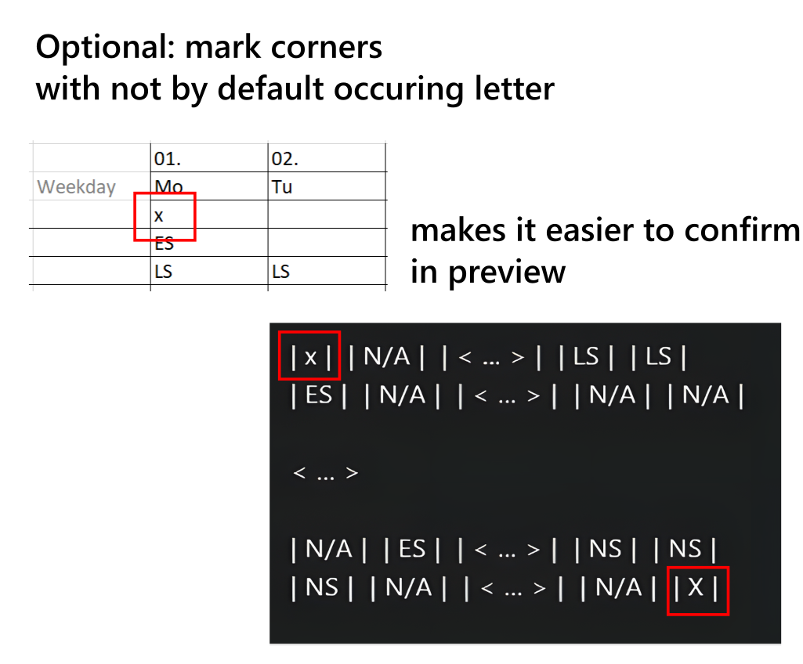

# ICS Extractor

Build with Compose Multiplatform. You can either download the distribution from release page or clone the project and run `./gradlew :composeApp:run`

## How to Use

### Disclaimer

The .ICS (iCalendar) file format is commonly used to store and share calendar and scheduling information. It is a plain text format structured in a specific way to represent calendar events and tasks. An ICS file typically consists of plain text lines that define various properties and attributes of calendar components.

A simple VEVENT (calendar event) within an ICS file typically looks like this:

````
BEGIN:VEVENT
SUMMARY:LS                  // description to be displayed in calendar
DTSTART:20230914T060000     // Start time in format YYYYMMDDTHHMMSS
DTEND:20230914T180000       // End time in format YYYYMMDDTHHMMSS
END:VEVENT
````

### Supported Rosters


## Tutorial

#### Used example


#### Get started

##### 1. Select the input file 
Click on the button on top left corner to open the file picker, than select the file with the roster you want to extract the events from.

#### 2. Select the output folder
Click on the button on top right corner to select the output folder

#### 3. Add events
By default, there are two events added on startup, you can either delete or edit them.

###### Standard event 
1. **Event name** => Here you need to type exactly the name from roster. In our case its `ES` for Early Shift
2. **Start Time** => Type in the start time with exactly 4 Digits. In our case its `0700`
3. **End Time** => Type in the end time with exactly 4 Digits. In our case its `1400`
4. **Overnight** => If the event persist overnight tig it. In our case we make sure its not checked.

###### Overnight event 
Its the same procedure like on standard event, just the checkmark is toggled.
In our case it would look like this for night shift.
- Event: `NS` Start `2100` End: `0700` Overnight: `checked`

#### 4. Table configuration
To make sure the software targets the correct columns and rows, we need to take care of valid config.

1. **Year** => The current year in 4-Digit format
2. **Month** => The current month in 2-Digit format (eg. for april `04`)
3. **Table** => Refers to the excel sheet index. It's usually `1`, if document does not contain more than one sheet
4. **Worker Column** => The column containing the worker names / abbreviations (in our case its `2`)
5. **First Row** => The first row that contains events. (in our case its `4`)
6. **First Column** => The first column that contains events. (in our case its `4`)
7. **Last Row** => The last row that contains events. (in our case its `11`)
8. **Last Column** => The last column that contains events. (in our case its `12`)

Although you could set last row / column automatically, it might not work as expected and validate through preview is necessary.

#### 5. Validate through preview
The Preview will show for each corner the first / last two fields of first / last two rows (e.g. 2x2)
Further more you can verify that worker column is set correctly, by confirming all workers are shown (not more or less) 
- In our example we make sure it looks like this:


**Its absolutely necessary that its only the area of shifts selected <span style="color:red">not more or less</span>.**

#### 6. Finish
Lastly you can export by clicking on bottom left corner and save whole configuration / events by clicking on bottom right corner

#### 7. Verify 
After clicking export you will see a log showing the created and excluded events.
Furthermore you can open the created `.ICS` Files with any text editor. A small description how this should look like is on top of this article in disclaimer.

#### 8. Importing 
On most devices it should be enough to just open the file on eg. phone an select your preferred calendar to execute. Sometimes it might necessary to import via calendar settings directly. Everything else would just be out of scope for this tutorial.

### Tips 

#### Numerate
As excel columns are numerated by Letters (A,B,C,D...) and this software needs an Number you can simply use the first ro to numerate. Therefore u can easier found the number of last column as in the example used.

#### Multiple rows For same worker
As in example visible the software does not care how many rows you use for same worker. All events will be included in one ics file.


#### Mark corners
Like in tutorial used, you can simply use any character (that is not assign to any event) to mark corners if they are empty