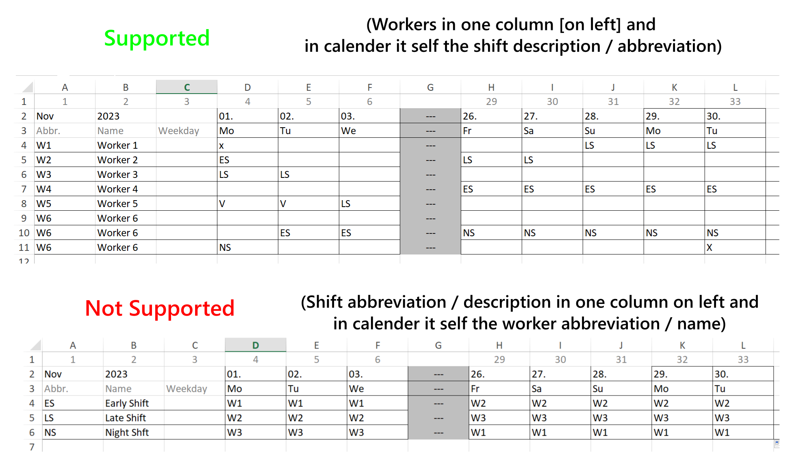

# ICS Extractor

Build with Compose Multiplatform. You can either download the distribution from release page or clone the project and run `./gradlew :composeApp:run`

## How to Use

### Disclaimer

The .ICS (iCalendar) file format is commonly used to store and share calendar and scheduling information. It is a plain text format structured in a specific way to represent calendar events and tasks. An ICS file typically consists of plain text lines that define various properties and attributes of calendar components.

A simple VEVENT (calendar event) within an ICS file typically looks like this:

````
BEGIN:VEVENT
SUMMARY:LS                  // description to be displayed in calendar
DTSTART:20230914T060000     // Start time in format YYYYMMDDTHHMMSS
DTEND:20230914T180000       // End time in format YYYYMMDDTHHMMSS
END:VEVENT
````

### Supported Rosters


## Tutorial

#### Used example


#### Get started

##### 1. Select the input file 
Click on the button on top left corner to open the file picker, than select the file with the roster you want to extract the events from.

#### 2. Select the output folder
Click on the button on top right corner to select the output folder

#### 3. Add events
By default there are to events added on startup, you can either delete or edit them.

###### Standard event 
1. Event name 
- Here you need to type exactly the name from roster. In our case its `ES` for Early Shift
2. Start Time
- Type in the start time with exactly 4 Digits. In our case its `0700`
3. End Time
- Type in the end time with exactly 4 Digits. In our case its `1400`
4. Overnight
- If the event persist overnight tig it. In our case we make sure its not checked.

###### Overnight event 
Its the same procedure like on standard event, just the checkmark is toggled.
In our case it would look like this for night shift.
- Event: `NS` Start `2100` End: `0700` Overnight: `checked`

#### 4. Table configuration

