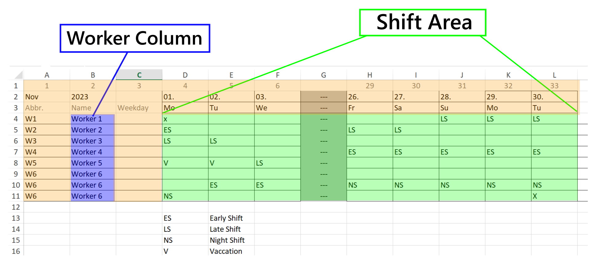
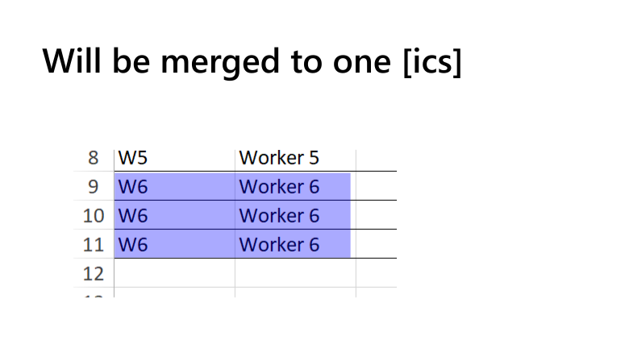

# ICS Extractor

Build with Compose Multiplatform. You can either download the distribution from release page or clone the project and run `./gradlew :composeApp:run`

Currently there is only a windows release, if you interested in macOS or linux release please write an issue.

## How to Use

### Side note

The .ICS (iCalendar) file format is commonly used to store and share calendar and scheduling information. It is a plain text format structured in a specific way to represent calendar events and tasks. An ICS file typically consists of plain text lines that define various properties and attributes of calendar components.

A simple VEVENT (calendar event) within an ICS file typically looks like this:

````
BEGIN:VEVENT
SUMMARY:LS                  // description to be displayed in calendar
DTSTART:20230914T060000     // Start time in format YYYYMMDDTHHMMSS
DTEND:20230914T180000       // End time in format YYYYMMDDTHHMMSS
END:VEVENT
````

### Supported Rosters


## Tutorial

#### Example Used


#### Get Started

##### 1. Select the Input File
Click on the button in the top left corner to open the file picker, then select the file with the roster from which you want to extract the events.

##### 2. Select the Output Folder
Click on the button in the top right corner to select the output folder.

##### 3. Add Events
By default, two events are added on startup, and you can either delete or edit them.

###### Standard Event
1. **Event Name** => Here you need to type the name exactly as it appears in the roster. In our case, it's `ES` for Early Shift.
2. **Start Time** => Type in the start time with exactly four digits. In our case, it's `0700`.
3. **End Time** => Type in the end time with exactly four digits. In our case, it's `1400`.
4. **Overnight** => If the event lasts overnight, check it. In our case, we make sure it's not checked.

###### Overnight Event
It's the same procedure as for the standard event, but the checkmark is toggled.
In our case, it would look like this for the night shift:
- Event: `NS` Start `2100` End: `0700` Overnight: `checked`

##### 4. Table Configuration
To ensure the software targets the correct columns and rows, we need to set up valid configuration.

1. **Year** => The current year in a four-digit format.
2. **Month** => The current month in a two-digit format (e.g., for April, `04`).
3. **Table** => Refers to the Excel sheet index. It's usually `1` if the document does not contain more than one sheet.
4. **Worker Column** => The column containing the worker names/abbreviations (in our case, it's `2`).
5. **First Row** => The first row that contains events (in our case, it's `4`).
6. **First Column** => The first column that contains events (in our case, it's `4`).
7. **Last Row** => The last row that contains events (in our case, it's `11`).
8. **Last Column** => The last column that contains events (in our case, it's `12`).

Although you could set the last row/column automatically, it might not work as expected, and validation through the preview is necessary.

##### 5. Validate Through Preview
The preview will display the first/last two fields of the first/last two rows (e.g., 2x2). Furthermore, you can verify that the worker column is set correctly by confirming that all workers are shown (not more or less). In our example, we make sure it looks like this:


It's absolutely necessary that only the area of shifts is selected, <span style="color:red">not more or less</span>.

##### 6. Finish
Lastly, you can export by clicking on the bottom-left corner and save the whole configuration/events by clicking on the bottom-right corner.

##### 7. Verify
After clicking export, you will see a log showing the created and excluded events. Furthermore, you can open the created `.ICS` files with any text editor. A small description of how it should look is at the top of this article in the side note.

##### 8. Importing
On most devices, it should be enough to open the file on, for example, a phone and select your preferred calendar to execute. Sometimes it might be necessary to import via calendar settings directly. Everything else would be out of the scope of this tutorial.

### Tips

#### Enumerate
As Excel columns are enumerated by letters (A, B, C, D...) and this software needs a number, you can simply use the first row to enumerate. Therefore, you can more easily find the number of the last column, as in the example used.

#### Multiple Rows for the Same Worker
As visible in the example, the software does not care how many rows you use for the same worker. All events will be included in one ICS file.



Check out our other Apps at [franz-sw.de](https://franz-sw.de/)
